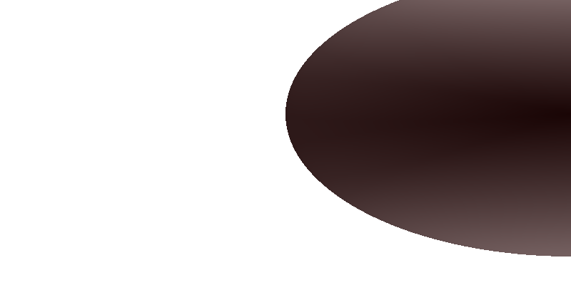
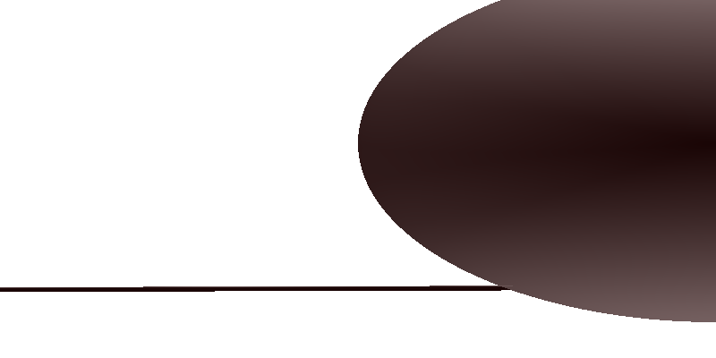
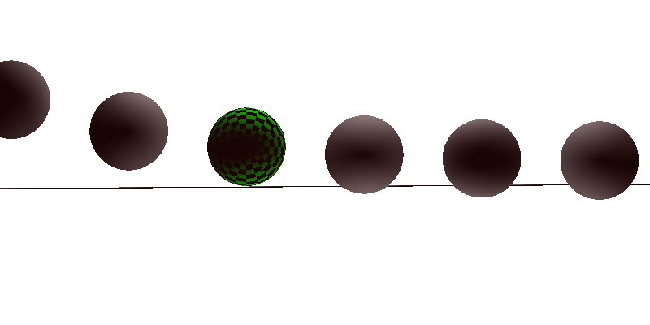
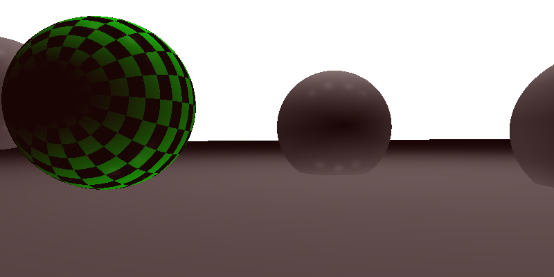
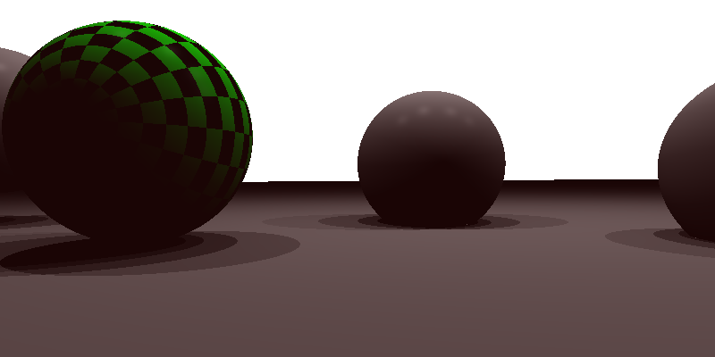
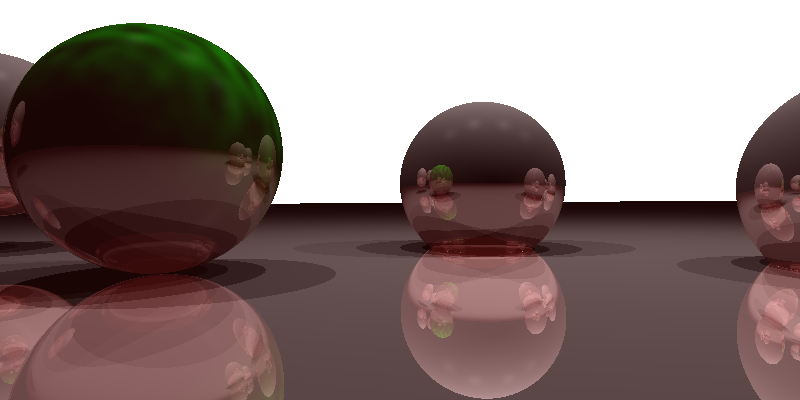

# Assignment 3 Report

## Details

* Name: Ryan Barclay
* V#: V00842513
* Code was running on Mac OS 12.1
* Compiler: cmake/3.22.1/bin/cmake

## Notes of implementation

* There were a few discrepancies with my images, see end picture in ex 4.
* Used code from class and from last assignment.
* Used a mixture of class teachings, documentation, and textbook to complete the assignment.

## Ex 0: Implement the intersection code [5pt]

I just used the code from the last assignment but added in a way to pass the t values out for later.

### ray_sphere_intersection



### ray_parallelogram_intersection



## Ex 1: Field of View and Perspective Camera [5pt]

### Correct value of image_x and image_y

I implemented this by using basic trig with the image given. It assumes that the camera will be facing the middle of the "lens/screen". Additionally it assumes the other two Theta's are the same.



### Correct image_x, image_y, and perspective

Just used teh same code / methodology as book and last assignment.


## Ex 2: Shadow Rays [10pt]

### Output with correct shading

Same as the last assignment just had to understand what was going on with ambient and the filled in diffuse shading.



### Output with shadows

For this function I got a bit creative. First I use find_nearest_object but use the light position and the ray direction is pointed towards out intersection point. As my previous code makes sure that there will never be a negative t, I don't have to worry about any object behind the light. So if the point returned is the same as the point that was intersected in the first place, then we are happy. Otherwise, it means that another object/ point was returned that was between the point and the light, thus blocking it.



## Ex 3: Reflection [10pt]

I used teh formula given by the readme.md, it is clever since d and v are parallel but in opposite directions. I also added in the recursive call and the termination logic.


## Ex 4/3?: Perlin Noise [10pt]

For this piece of the code I used the code we walked through in class and implemented it the same way.

When comparing the two interpolation methods, it was hard to determine any differences at first. Though the cubic interpolation seems to be less blocky and grainy. Though I do not  know if this is because of specific noise that was generated.

### Linear Interpolation


### Cubic Interpolation



## Final Note

To run this code you will need to just have the following in a directory and have the path of the terminal to the same directory:

```
src/*
runfast.sh OR rush.sh
CMakeLists.txt
```

Then you can simply run the run.sh or runfast.sh script to run the code.

The files in this assignment are the following:

```
img/*
img_for_submission/*
src/*
CMakeLists.txt
README.md
REPORT.md
run.sh
runfast.sh
```
